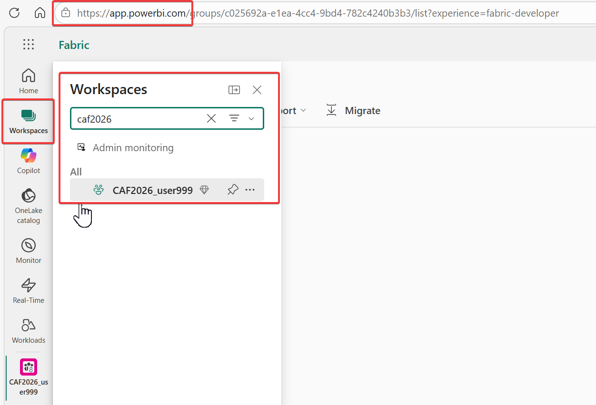
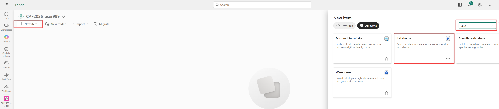
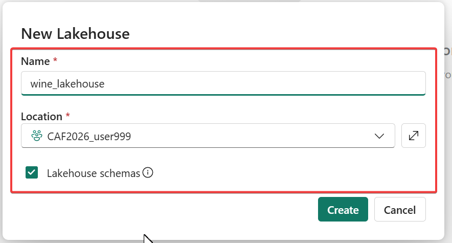
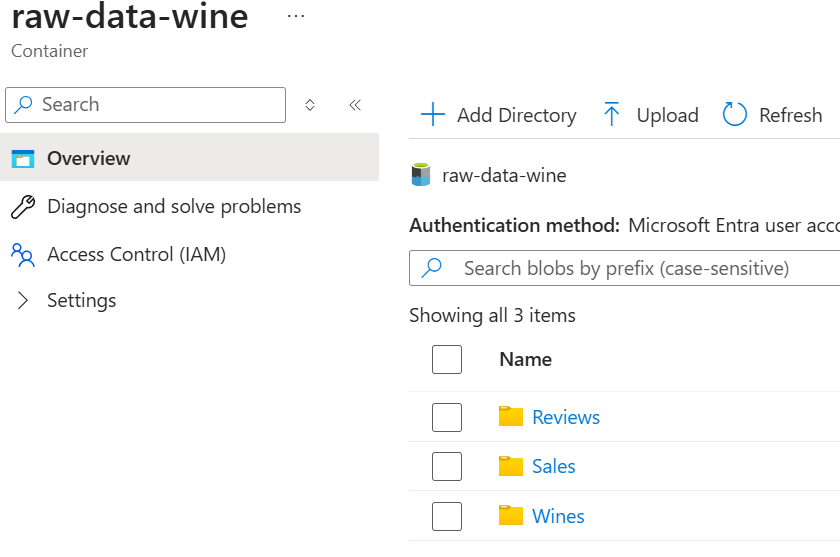
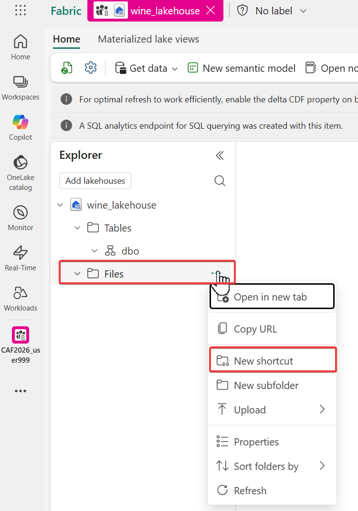
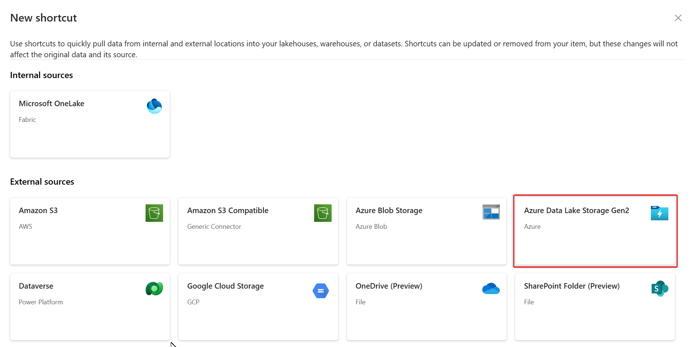
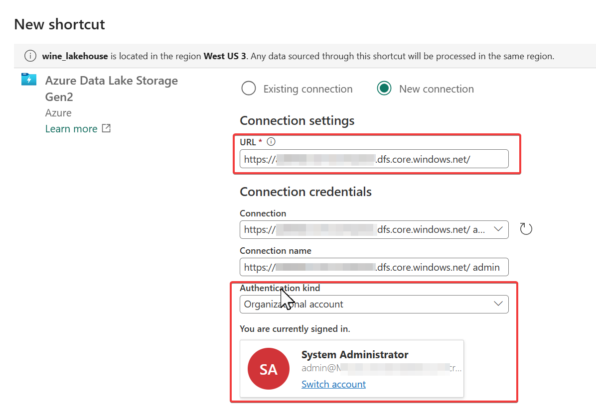
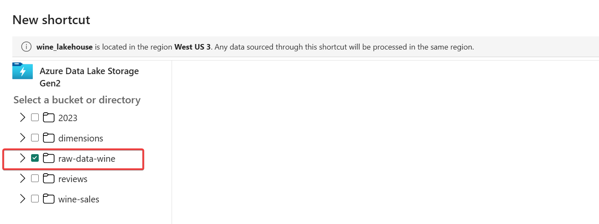
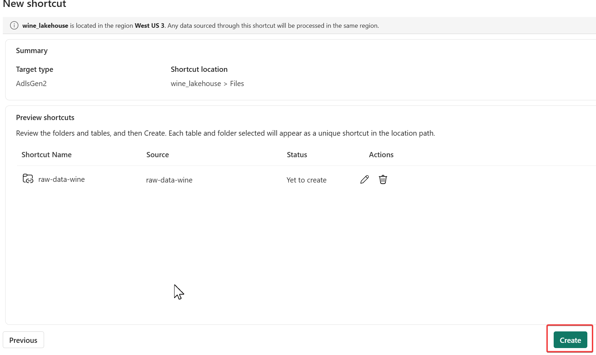
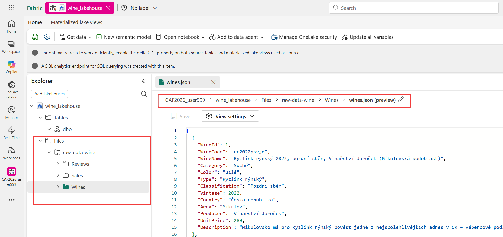

# Úvod
Cílem je získat data z POSky a recenzí do tvého nového Sandboxu vytvořeného v MS Fabric. Data jsou vyexportovaná aplikačním teamem do JSONů a leží v Azure Storage (máš k nim přístup ***Storage Blob Data Reader*** pod tvojí Entra identitou).
## Plán
1. Přihlásit se do svého Sandboxu
2. Založit Lakehouse
3. Udělat Shortcut mezi Lakehouse a Azure Storage

### 1.Přihlásit se do svého Sandboxu

- **Udělej:** Připoj se svým Entra Id do MS Fabric: [Microsoft Fabric](https://app.fabric.microsoft.com/) nebo do [Microsoft Power BI](https://app.powerbi.com/) 

- Zde by jsi měl vidět svůj pracovní prostor: **CAF2026_***EntraId*** (např. CAF2026_user999)

### 2. Založit Lakehouse

- Založ svůj nový Lakehouse: **wine_lakehouse**, do kterého budeš integrovat zdrojová data z POSky a rezenzí.  
	- **Udělej:** New item > vyhledej lake > vyber Lakehouse

- **Udělej:** Vytvoř Lakehouse a pojmenuj jej: **wine_lakehouse**

### 3. Udělat Shortcut mezi Lakehouse a Azure Storage

Zdrojová data jsou umístěna na Azure blob storage ve formě JSON souborů.

U klasických datových platforem by jsi musel data nejdříve nahrát pomocí ETL nástrojů, ale u MS Fabric to dělat nemusíš. MS Fabric podporuje tzv. [OneLake shortcuts](https://learn.microsoft.com/en-us/fabric/onelake/onelake-shortcuts) ala "symbolic link / soft link na Linuxu".

-  **Udělej:** Ve svém Lakehouse vyber "Files" > ... > "New shortcut" 

-  **Udělej:** vyber Azure Data Lake Storage Gen2

-  **Udělej:** vytvoř nové připojení:
	- URL:  https://XXXXXXXX.dfs.core.windows.net/
	- Auth. kind: Organization account
	- Signed in.: Tvoje Entra Id

- **Udělej:** vyber "raw-data-wine" container

- **Udělej:** Create

- **Udělej:** Zkontroluj, že byl vytvořen Shortcut a můžeš procházet zdrojová data.
 

## Tvůj další úkol je: 
> [Transformovat data do tabulárního datového modelu](/challenges/business-data-agent/challenges/02_curated_data.md)
