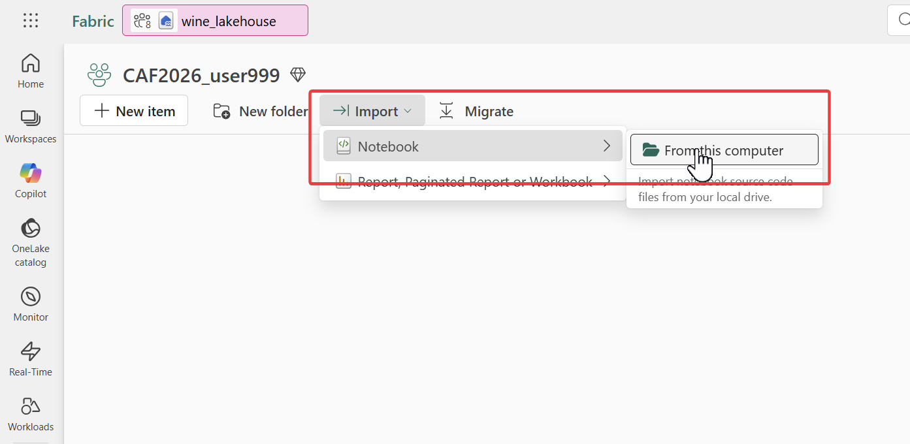
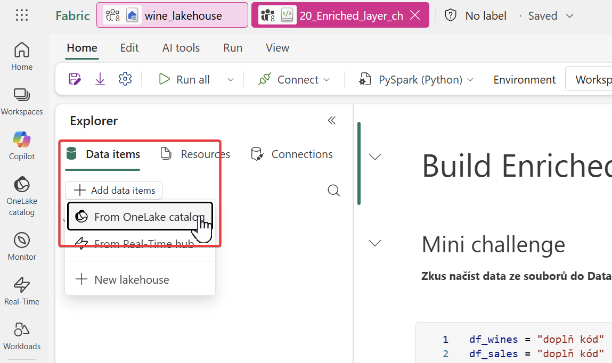
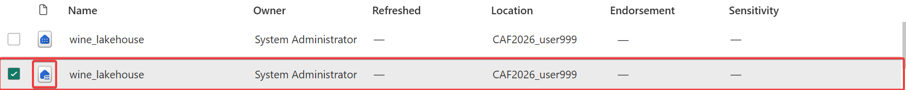
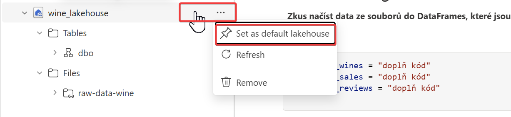
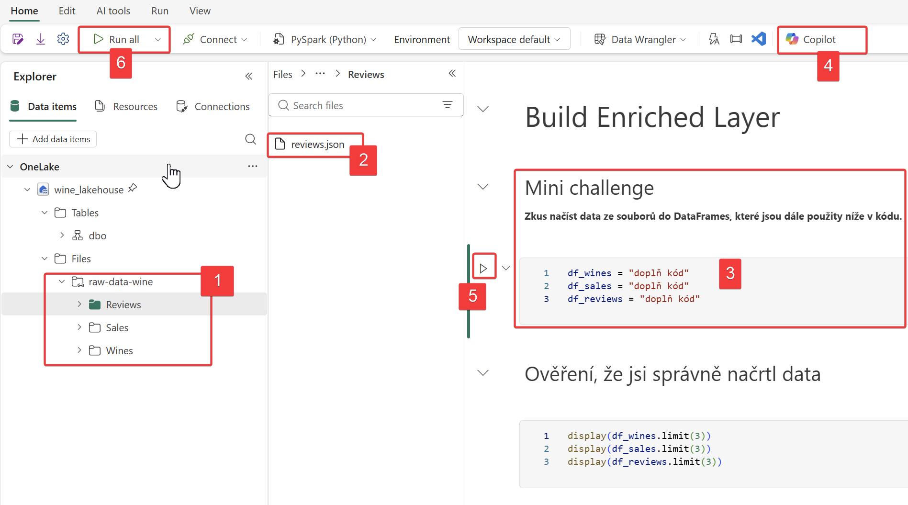
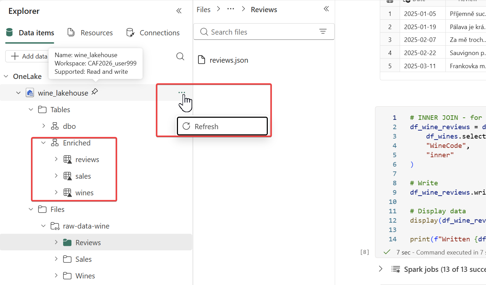
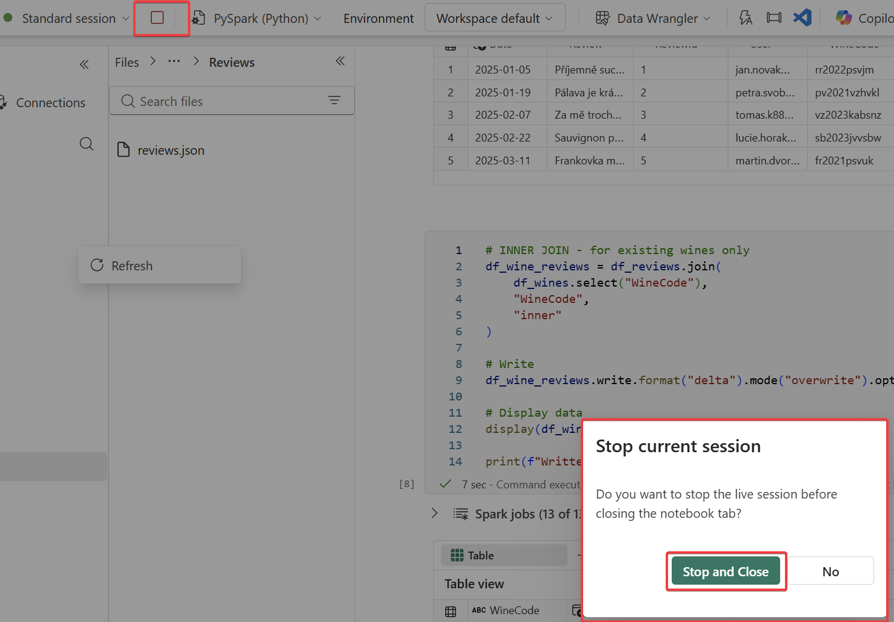
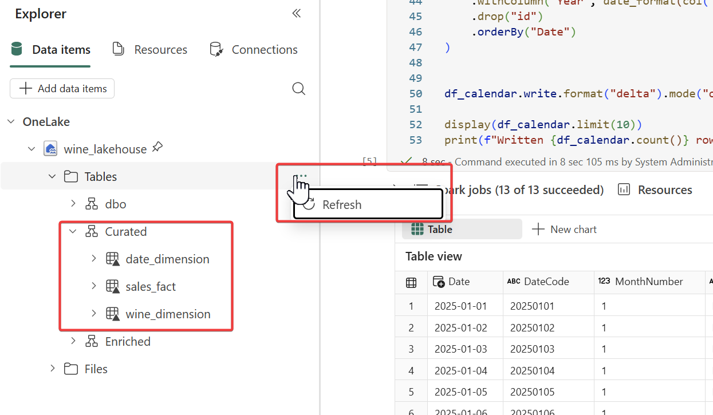

# Úvod
**Cílem je připravit si data pro datového agenta**, tzn. vybudovat ***Enriched a Curated*** vrstvy v [**Lakehouse architektuře** (jednotlivé vrstvy jsou vysvětlené na tomto linku).](/challenges/business-data-agent/challenges/lakehouse-layers.md) 

K tomuto úkolu máš připravenou veškerou potřebnou infrastrukturu a knihovny, tj. Managed Apache Spark Cluster (pouze jeden "node"). 

## Plán
1. Transformovat "Raw" data do "Enriched" vrstvy
2. Transformovat "Enriched" data do "Curated" vrstvy

### 1. Transformovat "Raw" data do "Enriched" vrstvy

Zdrojová data je potřeba správně natypovat, obohatit a zajistit platné relace před uložením do [Enriched vrstvy v Lakehouse.](/challenges/business-data-agent/challenges/lakehouse-layers.md)

Transformační kód pro Enriched vrstvu v ***PYSPARKu*** nemusíš vymýšlet, připravil Ti jej náš Data Engineer spolu s [MS Fabric Copilotem](https://learn.microsoft.com/en-us/fabric/data-engineering/copilot-notebooks-overview). Pouze si stáhni hotový notebook, který nahraješ do svého Sandboxu (workspace) a připojíš si k němu svůj lakehouse.

Ale má to jeden háček, **musíš vyřešit "mini" challenge** - kolega Ti odmazal část kódu pro načtení ***JSON souborů*** do DataFrame. Klidně použij [MS Fabric Copilot](https://learn.microsoft.com/en-us/fabric/data-engineering/copilot-notebooks-overview) nebo [M365 Copilot](https://m365.cloud.microsoft/chat) nebo kontextové menu u souboru (případně dole na stránce najdeš řešení).

- **Udělej:** [Zde](/challenges/business-data-agent/sourcecode/20_Enriched_layer_ch.ipynb) si stáhni notebook 20_Enriched_layer_ch.ipynb

- **Udělej:** Naimportuj notebook do svého workspace a otevři jej

- **Udělej:** Připoj si svůj Lakehouse pomocí Data items > Add Data items > From OneLake catalog

- **Udělej:** Vyber svůj Lakehouse 

> [!IMPORTANT]
**POZOR!** Pokud uvidíš dva stejné názvy, tak vyber ten, který má ikonu s vlnkou (ten druhý je SQL analytics endpoint)

- **Udělej:** (tento krok by měl být "by default") Nastav Lakehouse jako "default" Lakehouse ve svém notebooku 

 

- **Udělej:** Vyřeš **"mini" challenge**, který je uveden v Notebooku, poté spusť jednotlivé buňky v notebooku (projdi si kód) nebo spusť celý notebook najednou. 
	- Popis screenshotu:
		- (1) Shortcut na data v Azure Storage
		- (2) V každé složce najdeš jeden JSON soubor (nápověda: má kontextové menu)
		- (3) Doplň chybějící kód (kód je stejný, pouze cesta a název na JSON soubor jsou různé)
		- (4) Můžeš zavolat Copilot chat / případně je k dispozici u každé buňky (potřebuješ načíst data z JSON souborů)
		- (5) Spusť kód buňky - můžeš jít buňku po buňce a spouštět je
		- (6) Případně můžeš spustit všechny buňky najednou

 
 

**Výsledek:** po úspěšném doběhnutí všech buněk, **udělej "Refresh" metadat**, poté by jsi měl vidět **nové schéma "Enriched" a v něm 3 tabulky: reviews, sales a wines**.

**Udělej:** Odpoj session od Spark Clusteru a zavři notebook (Stop and Close).

 

### 2. Transformovat "Enriched" data do "Curated" vrstvy
Datový agent bude pracovat oproti [Curated vrstvě v Lakehouse](/challenges/business-data-agent/challenges/lakehouse-layers.md), která je primárně optimalizovaná pro dotazování (denormalizované tabulky ala dimenze a faktovky, [V-Order](https://learn.microsoft.com/en-us/fabric/data-engineering/delta-optimization-and-v-order?tabs=sparksql) pro uložení dat).

Transformační kód pro Curated vrstvu ve ***Spark SQL*** nemusíš vymýšlet, připravil Ti jej náš Data Engineer. Pouze si stáhni hotový notebook, který nahraješ do svého Sandboxu (workspace), připojíš si svůj lakehouse a spustíš kód.

Postup je stejný jako v 1. části:

- **Udělej:** [Zde](/challenges/business-data-agent/sourcecode/30_Curated_layer.ipynb) si stáhni notebook 30_Curated_layer.ipynb
- **Udělej:** Naimportuj notebook do svého workspace a otevři jej
- **Udělej:** Připoj si svůj Lakehouse pomocí Data items > Add Data items > From OneLake catalog
- **Udělej:** Vyber svůj Lakehouse

> [!IMPORTANT]
**POZOR!** Pokud uvidíš dva stejné názvy, tak vyber ten, který má ikonu s vlnkou (ten druhý je SQL analytics endpoint)

- **Udělej:** (mělo by být "by default") Nastav Lakehouse jako "default" Lakehouse ve svém notebooku

- **Udělej:** Spusť jednotlivé buňky v notebooku (projdi si kód) nebo spusť celý notebook najednou.
 
 

**Výsledek:** po úspěšném doběhnutí všech buněk, **udělej "Refresh" metadat**, poté by jsi měl vidět **nové schéma "Curated" a v něm 3 tabulky**: date_dimension, sales_fact a wine_dimension.

- **Udělej:** Odpoj session od Spark Clusteru a zavři notebook (Stop and Close).

## Tvůj další úkol je: 
> [Procesovat text recenzí LLM modely do strukturované podoby](/challenges/business-data-agent/challenges/03_llm_ai_functions.md)

## Řešení pro mini challenge: 
> [1. Transformovat "Raw" data do "Enriched" vrstvy](/challenges/business-data-agent/solutions/02_enriched_data_solution.md)
