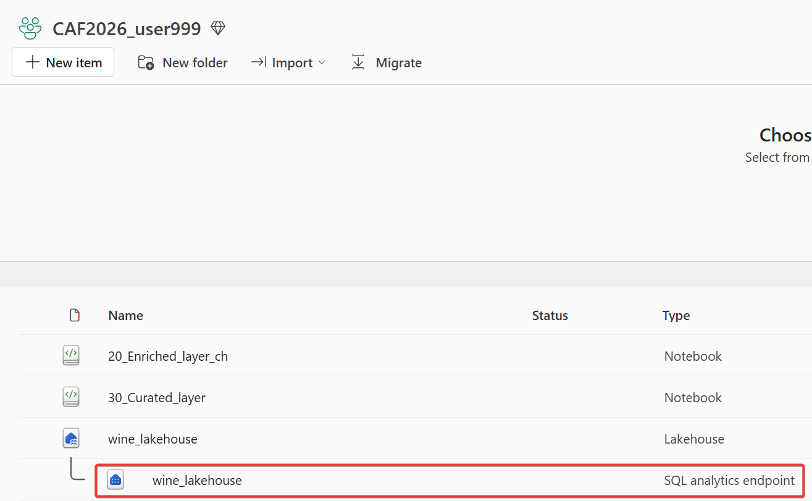
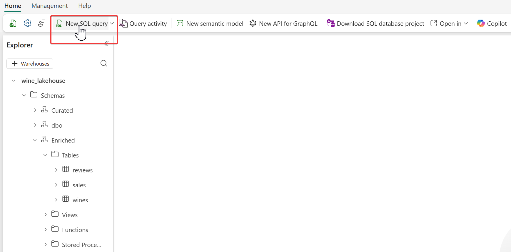
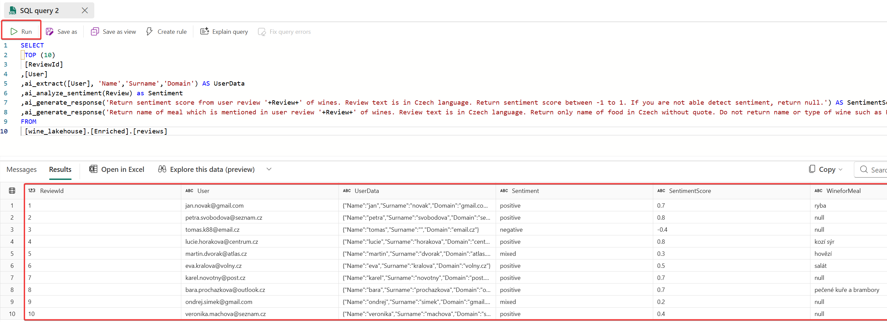
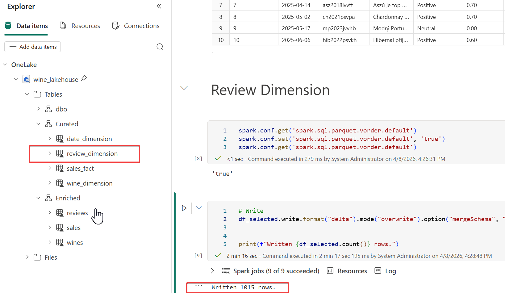

# Úvod
Cílem je získat zajímavé informace z recenzí od našich uživatelů jako je sentiment nebo párování vín k jídlu. Recenze je nestrukturovaný text, který je potřeba zpracovat. Jak? Například pomocí LLM modelů. MS Fabric obsahuje **[pre-built AI modely](https://learn.microsoft.com/en-us/fabric/data-science/ai-services/ai-services-overview#prebuilt-ai-models-in-fabric-preview) (OpenAI ala gpt-5x, gpt-4x nebo Text Analytics)**, ale jejich použití vyžaduje hodně kódování. Pokud nechceš kódovat, pak můžeš využit **AI Functions pro [SQL](https://learn.microsoft.com/en-us/fabric/data-warehouse/ai-functions) nebo [Spark / Pandas](https://learn.microsoft.com/en-us/fabric/data-science/ai-functions/overview?tabs=pandas-pyspark%2Cpandas)**.
## Plán
1. Zkusit AI Functions v SQL (volitelné)
2. Zpracovat recenze s AI Functions v Apache SPARK 

### 1.Zkusit AI Functions v SQL (volitelné)
Pro business uživatele je nejsnazší používat **AI Functions pomocí jazyka SQL**. V MS Fabric má každý Lakehouse svůj **SQL analytics endpoint**, který se tváří jako klasický SQL Server podporující T-SQL syntaxi.

- **Udělej:** Klikni na wine_lakehouse SQL analytics endpoint 



- **Udělej:** Vyber New SQL Query 



- **Udělej:** Nakopíruj níže uvedený SQL dotaz do Query editoru a spust jej

```SQL
SELECT
 TOP (10)
 [ReviewId]
,[User]
,ai_extract([User], 'Name','Surname','Domain') AS UserData
,ai_analyze_sentiment(Review) as Sentiment
,ai_generate_response('Return sentiment score from user review '+Review+' of wines. Review text is in Czech language. Return sentiment score between -1 to 1. If you are not able detect sentiment, return null.') AS SentimentScore
,ai_generate_response('Return name of meal which is mentioned in user review '+Review+' of wines. Review text is in Czech language. Return only name of food in Czech without quote. Do not return name or type of wine such as Pálava, Rulandské šedé. If the is not any meal, retur null.') AS WineforMeal
FROM 
 [wine_lakehouse].[Enriched].[reviews]
```

- **Výsledek**: Zpracované recence ve formě strukturovaných dat




### 2. Zpracovat recenze s AI Functions v Apache SPARK 
Pro rozšíření Curated vrstvy o poslední tabulku s informacemi o recenzích, použij AI Functions ve Sparku. Kód máš připaven v notebook, který si opět nahraj do svého Sandboxu (workspace), připoj si svůj lakehouse a spusť všechny buňky.

Postup je stejný jako v předchozím úkolu:

- **Udělej:** [Zde](/sourcecode/40_Curated_Enrichment_with_AI.ipynb) si stáhni notebook 40_Curated_Enrichment_with_AI.ipynb
- **Udělej:** Naimportuj notebook do svého workspace a otevři jej
- **Udělej:** Připoj si svůj Lakehouse pomocí Data items > Add Data items > From OneLake catalog
- **Udělej:** Vyber svůj Lakehouse 

> [!IMPORTANT]
**POZOR!** Pokud uvidíš dva stejné názvy, tak vyber ten, který má ikonu s vlnkou (ten druhý je SQL analytics endpoint)


- **Udělej:** Nastav jej jako "default" Lakehouse ve svém notebooku
- **Udělej:** Spusť jednotlivé buňky v notebooku (projdi si kód) nebo spusť celý notebook najednou

- **Výsledek:** Tabulka review_dimension ve schématu Curated s 1015 řádky.



- **Udělej:** Odpoj session od Spark Clusteru a zavři notebook (Stop and Close).


## Tvůj poslední úkol je: 
> [Vytvořit a vyladit datového agenta](/challenges/business-data-agent/challenges/04_data_agent)

