# Úvod
Cílem je vytvořit a odladit datového agenta, který bude schopen odpovídat na otázky psané přirozenou řečí o prodejích vín a spokojenosti našich zákazníků s nabízeným sortimentem. Zároveň agent bude připraven pro připojení do agentního workflow připravovaného naším aplikačním teamem.

## Plán
1. Založit datového agenta
2. Otestovat agenta pomocí "sample" dotazů
3. Ladit / optimalizovat agenta pomocí Instructions a Examples queries
4. Vypublikovat agenta pro agentní framework (Copilot Studio, MS Foundry, MCP, ...)


### 1. Založit datového agenta
[Datového agenta](https://learn.microsoft.com/en-us/fabric/data-science/concept-data-agent) nemusíš programovat, je to základní komponenta MS Fabric, která umožňuje vytvářet vlastní konverzační systémy typu Q&A s využitím generativní AI.
V rámci širších agentních architektur slouží datoví agenti jako konverzační analytická komponenta, která se v multi-agentních řešeních napojuje na data v MS Fabric (lakehouse, warehouse, semantic model, Graph, SQL a KQL db) se zajištěním bezpečnostního nastavení ala Row-level, Column-level, Object-level security.

- **Udělej:** Vytvoř datového agenta: + New item > Data agent

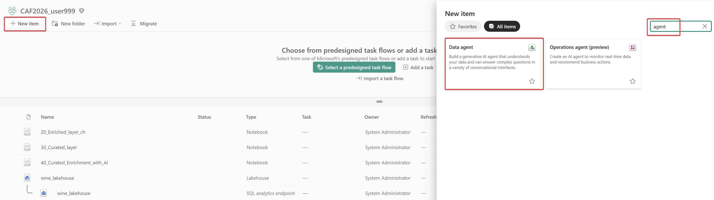

- **Udělej:** Pojmenuj jej, např.: **wine_analyst**

- **Udělej:** Připoj si svůj Lakehouse pomocí Add Data > wine_lakehouse

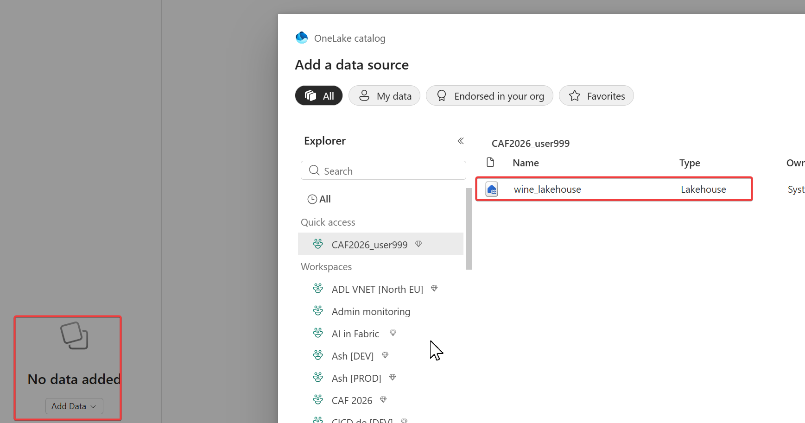


- **Udělej:** Nastav kontext pro agenta: vyber všechny tabulky ze schema Curated

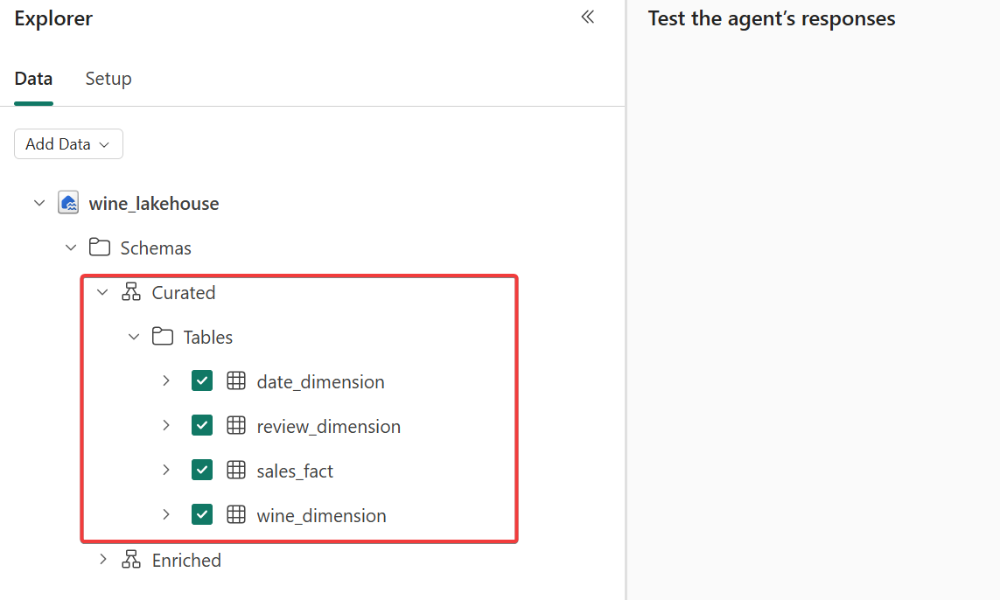

### 2. Otestovat agenta pomocí "sample" dotazů
Agent má jediný kontext a to je seznam tabulek, jejich sloupce a datové typy. Pokud máš srozumitelný datový model (dobře pojmenované sloupce s jasným významem), pak je schopen odpovídat na běžné dotazy bez dodatečných instrukcí.

Zkus se zeptat na základní dotazy:
- Které víno se prodalo v roce 2025 v největším množství. Vrat' kód vína a počet kusů.
    - **Očekávaná odpověď** je: **iz2019lvvpl , 1721**
- Jaká byla průměrná výše slevy na jednu transakci v roce 2025? Vrat' pouze číslo.
    - **Očekávaná odpověď** je: **2.18**
- Který měsíc roku 2025 měl nejvyšší tržby? Vrať pouze anglické jméno měsíce.
    - **Očekávaná odpověď** je: **May**
- Ve které obchodě se v roce 2025 prodalo nejvíce vín? Vrať pouze název obchodu.
    - **Očekávaná odpověď** je: **Zlín**

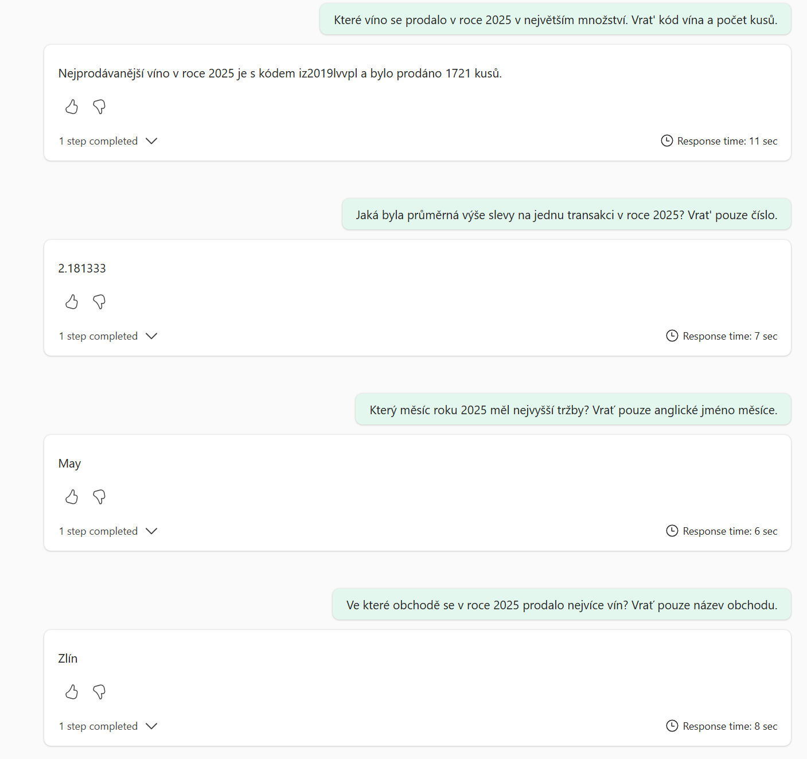

### 3. Ladit / optimalizovat agenta pomocí Instructions a Examples queries

Zkus se zeptat na otázku:
- Kolik jsme měli aktivních influencerů k 1.5.2025?
    - **Očekávaná odpověď** je: **7,** ale agent odpověděl **232**

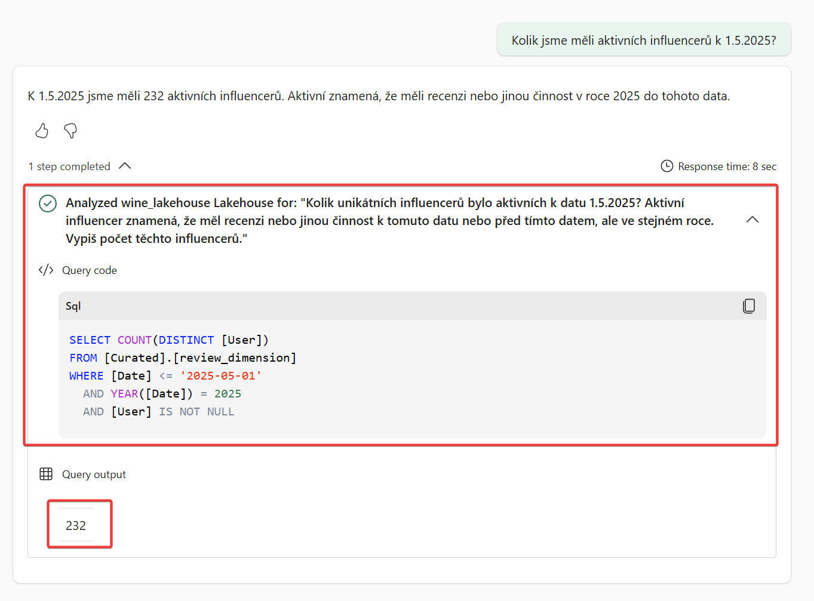


-  **Udělej:** Vyřeš **"mini" challenge** - nastav agenta tak, aby rozuměl tomu, co je myšleno "aktivním influencerem" = **uživatel, který za poslední 3 měsíce napsal 2 a více pozitivních recenzí.**
    - Můžeš využít [Agent Instructions / Data source Instructions](https://learn.microsoft.com/en-us/fabric/data-science/data-agent-configurations) nebo lépe [Few shots / Example Queries](https://learn.microsoft.com/en-us/fabric/data-science/data-agent-example-queries).

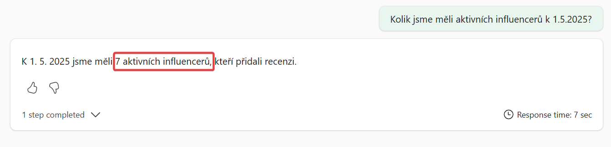


### 4. Vypublikovat agenta pro agentní framework (Copilot Studio, MS Foundry, MCP, ...)
Aplikační team již čeká na tvého agenta, aby jej mohl integrovat do agentního workflow. Předtím, než jej vypublikuješ, doplň potřebné instrukce ... příklady najdeš zde: ([agent instructions](/solutions/agent_instructions.md), [datasource description](/solutions/datasource_description.md), [datasource instructions](/solutions/datasource_instructions.md), [example queries](/solutions/04_data_agent_solution.md)).


-  **Udělej:** Vyplň instrukce.

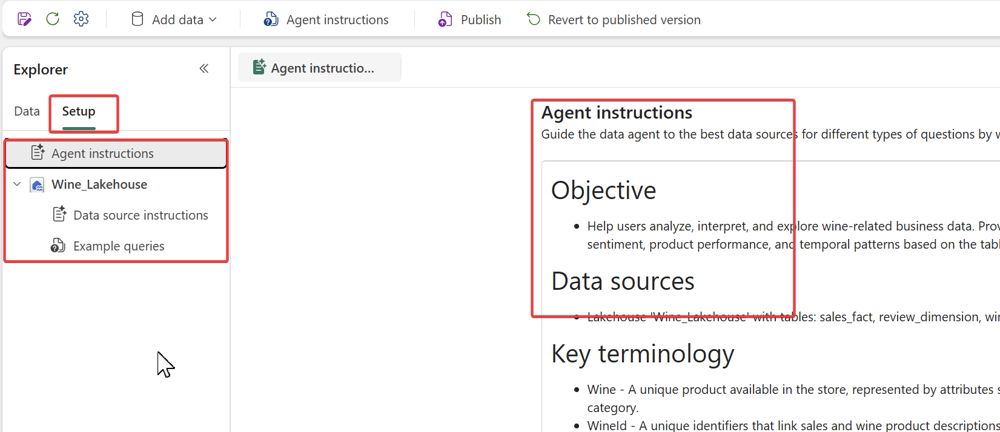


-  **Udělej:** Poté klikni na tlačítko Publish

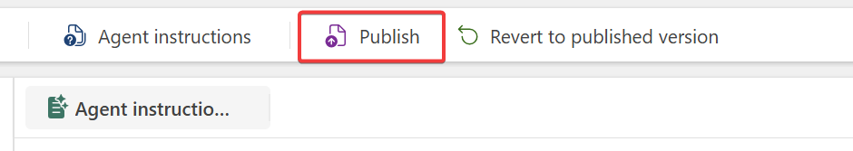


-  **Udělej:** Doplň "Description of purpise and capabilities" a vypublikuj
```
This Data Agent helps users analyze wine retail business data using natural language. It provides insights into sales performance, customer sentiment, product trends, store performance, and the impact of discounts over time. The agent accesses data from the Wine_Lakehouse (sales_fact, review_dimension, wine_dimension, date_dimension) to answer questions about revenue and volume trends, customer reviews, seasonal demand, regional performance, and product attributes such as type, category, vintage, or producer.
It supports time‑based and segmented analysis to assist with sales optimization, promotion effectiveness, and understanding customer preferences across wines and stores. Sample questions:
1/ Která vína jsou TOP podle tržeb a prodaného množství za brezen 2026 a jak se to změnilo mezi měsíci (MoM)?
2/ Jak se liší prodeje podle atributů vína — barva (Color), typ (Type), kategorie (Category), ročník (Vintage)?
3/ Které prodejny (Store) rostou/klesají nejvíce a jaký mají mix platebních metod?
4/ Jaká je sezónnost prodeje a špičky kolem svátků (Silvestr/Nový rok, Valentýn, Velikonoce) vs. běžné období?
5/ Které víno se prodalo v roce 2025 v největším množství?
6/ Jaká byla průměrná výše slevy na jednu transakci v roce 2025?
7/ Který měsíc roku 2025 měl nejvyšší tržby? 
8/ Ve které obchodě se v roce 2025 prodalo nejvíce vín? 
```

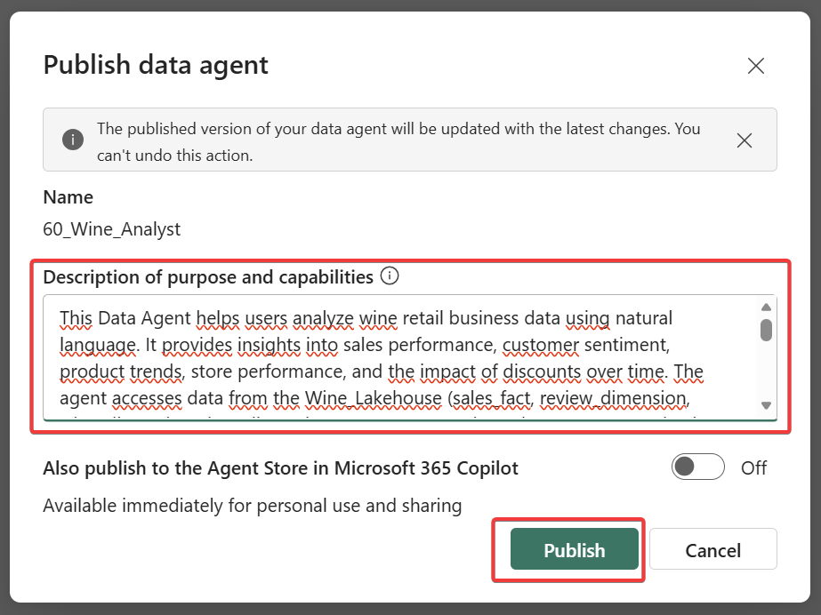


## Výsledek
**Gratulujeme**, právě jsi dokončil svůj první úkol! Tvůj **Data Agent** je nyní dostupný ostatním přes MCP.

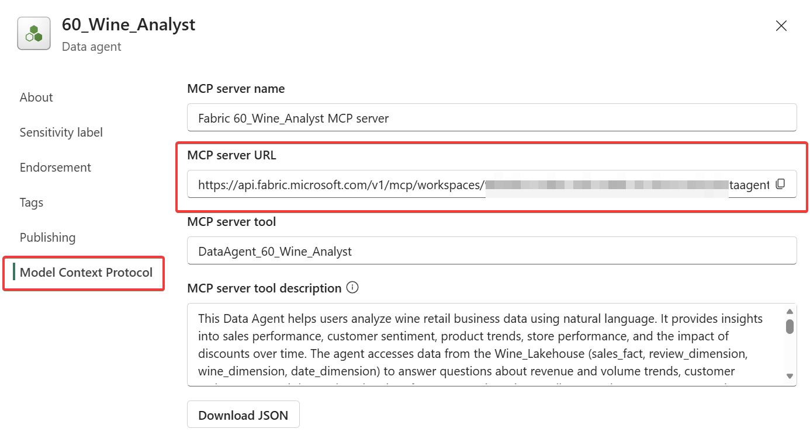


Na závěr se zeptej agenta jaké Ti doporučí víno a to si večer vyžádej u sommeliera :).

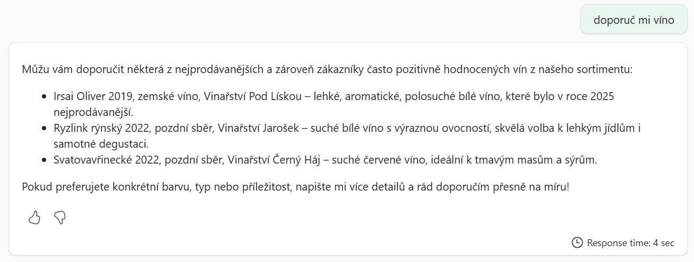


## Řešení: 
> [Few shot example](/Solutions/04_data_agent_solution.md)