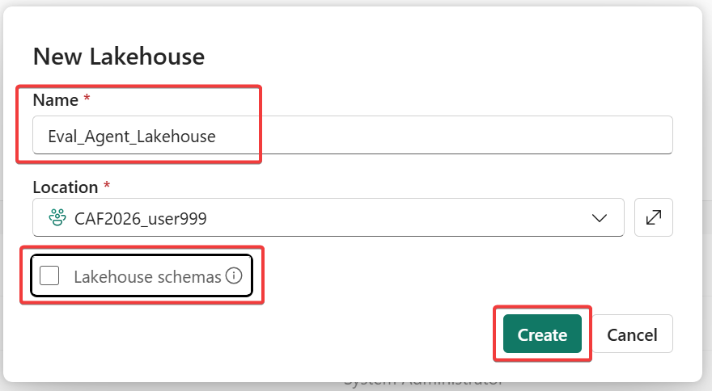
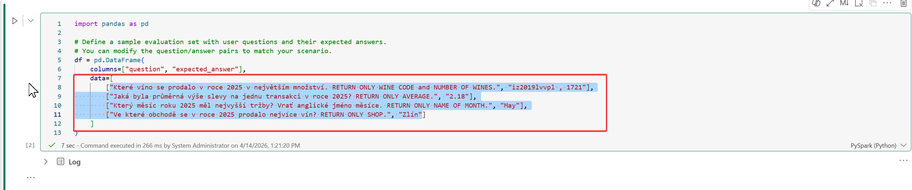
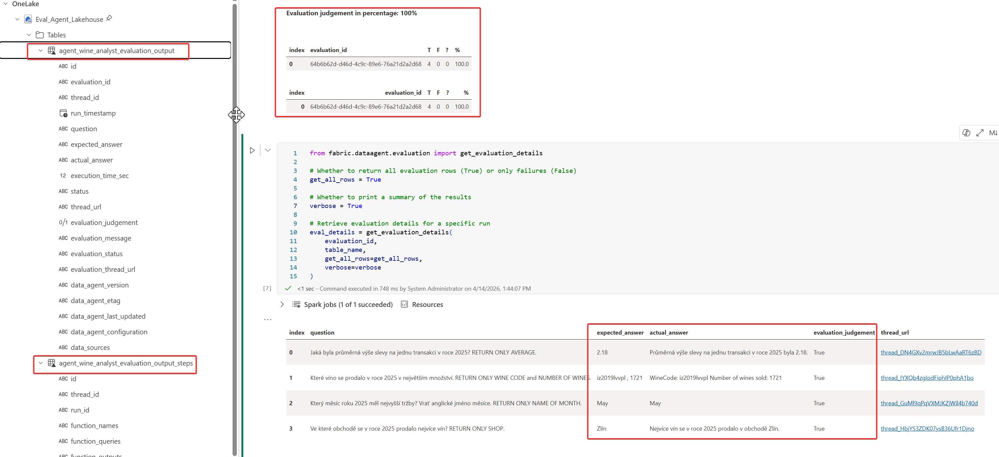

# Úvod
Pokud jsi zvládl všechny úkoly a máš čas, pak si můžeš vyzkoušet automatické testování a vyhodnocování datového agenta pomocí [Python SDK](https://learn.microsoft.com/en-us/fabric/data-science/evaluate-data-agent).

## Plán
1. Založit nový lakehouse bez schémat
2. Naimportovat testovací notebook
3. Vytvořit sadu otázek a odpovědí 
4. Testovat > vyhodnocovat > ladit > testovat ...

### 1. Založit nový lakehouse bez schémat

- **Udělej:** Vytvoř nový lakehouse: ***Eval_Agent_Lakehouse***, který **NEpodporuje "Lakehouse schemas"**

### 2. Naimportovat testovací notebook
Postup je stejný jako v [2. úkolu](/challenges/business-data-agent/challenges/02_curated_data.md):

- **Udělej:** [Zde](/challenges/business-data-agent/sourcecode/Evaluate_Data_Agent.ipynb) si stáhni notebook: Evaluate_Data_Agent.ipynb
- **Udělej:** Naimportuj notebook do svého workspace a otevři jej
- **Udělej:** Připoj si výše vytvořený Lakehouse pomocí Data items > Add Data items > From OneLake catalog
- **Udělej:** Vyber svůj Lakehouse

> [!IMPORTANT]
**POZOR!** Pokud uvidíš dva stejné názvy, tak vyber ten, který má ikonu s vlnkou (ten druhý je SQL analytics endpoint)

### 3. Vytvořit sadu otázek a odpovědí 

- **Udělej:** Druhá buňka v notebooku obsahuje pole se sadou otázek a očekávaných odpovědí. Použij stávající, případně doplň vlastní. (Otázky a odpovědi lze číst přímo ze souboru nebo z tabulky).

### 4. Testovat > vyhodnocovat > ladit > testovat ...

- **Udělej:** Projdi si jednotlivé buňky a spuť je (případně spusť celý notebook).

## Výsledek:  
Výsledné vyhodnocení je zapsáno do dvou tabulek v lakehouse, případně je uvedeno níže v buňkách (summary a detail per otázka). Pokud u některých otázek dostáváš "False", pak je potřeba instruovat agenta pomocí **Few shots**, případně pomocí **Instructions** viz [Vytvořit a vyladit datového agenta](/challenges/business-data-agent/challenges/04_data_agent.md).

