# Znalostní agent s Foundry IQ

Foundry IQ je navržené pro vytváření znalostní báze, která reprezentuje institucionální znalosti firmy kombinací různých částečně strukturovaných nebo nestrukturovaných multimodálních zdrojů. Poskytuje AI zpracování textu, dokumentů, obrázků a zvukových vstupů a také agentní vyhledávání pomocí hledání podle klíčových slov, sémantického vyhledávání, sémantického přerovnání výsledků, plánování a přepisování dotazů a agentních iterací pro dosažení co nejlepších výsledků. Hlavní myšlenkou je vytvořit řešení zaměřené na konkrétní doménové znalosti a poskytnout znovupoužitelného, testovatelného datového agenta, kterého mohou později využívat uživatelské agenti.

Lidé, kteří rozumějí datům, jsou odpovědní za vytváření Foundry IQ a za poskytování testovatelného, spolehlivého a kvalitního agentního vyhledávání. Různí uživatelsky zaměření agenti se pak mohou soustředit na interakce s uživatelem a integrace namísto toho, aby se zbytečně snažili přímo procházet zdrojová data bez odpovídajících nástrojů a znalostí.

Během této výzvy budete:
- používat prostředí Azure s Microsoft Foundry, Foundry IQ, Blob Storage, AI Search a souvisejícími službami,
- vytvářet indexer importem `wines.json`, aby vznikl index připravený pro hledání podle klíčových slov i sémantické vyhledávání,
- přidávat sémantickou konfiguraci a ověřovat, že vyhledávání funguje od začátku do konce,
- vytvářet znalostní bázi ve Foundry a propojit s ní index,
- přidávat zpracování zvukových souborů,
- přidávat pokročilé zpracování PDF pro text, tabulky, obrázky a grafy,
- přidávat webové vyhledávání pomocí vybraných webů zaměřených na víno,
- spojovat všechny zdroje do jedné znalostní báze a vytvořit Foundry Agenta, který ji používá,
- importovat evaluace a ověřit, že agent projde funkčními i red-team testy.

## Přehled dat, se kterými budeme pracovat
Ve svém storage účtu najdete PDF soubory s obrázky, infografikami, grafy a tabulkami.

[{:class="img-fluid"}](images/2026-04-10-11-04-37.png)

[{:class="img-fluid"}](images/2026-04-10-11-05-48.png)

Máme také `wines.json`, který obsahuje data o vínech včetně bohatého textového nestrukturovaného pole s popisem vinařství, chuti, historie, barvy a dalších vlastností.

[{:class="img-fluid"}](images/2026-04-10-11-11-03.png)

Posledním zdrojem dat jsou nahrávky podcastů s klíčovými hosty z vinařského odvětví.

[{:class="img-fluid"}](images/2026-04-10-11-12-40.png)

## Zpracování vín a jejich popisů
Nejprve zpracujeme soubor `wines.json` a vytvoříme index v **AI Search**. Pracovat budeme v [Azure portálu](https://portal.azure.com). 

Ve své resource group najděte AI search a pojďme importovat data.

[{:class="img-fluid"}](images/2026-04-10-13-15-49.png)

[{:class="img-fluid"}](images/2026-04-10-13-16-27.png)

[{:class="img-fluid"}](images/2026-04-10-13-16-54.png)

Vyberte storage account, wines kontejner a formát bude JSON array. Ověřovat se budeme přes managed identity.

[{:class="img-fluid"}](images/2026-04-24-15-06-54.png)

Detailní nestrukturovaný popis vína je ve sloupečku Description - to budeme chtít vektorizovat a provádět nad ním semantické vyhledávání.

[{:class="img-fluid"}](images/2026-04-24-15-07-55.png)

Povolíme semantický ranker pro pokročilejší hybridní vyhledávání a dojdeme na konec.

[{:class="img-fluid"}](images/2026-04-10-13-22-49.png)

[{:class="img-fluid"}](images/2026-04-10-13-23-25.png)

Zpracování souboru provádí Indexer - doběhl vám v pořádku?

[{:class="img-fluid"}](images/2026-04-10-13-24-46.png)

Podívejte se do indexu a zkuste vyhledávání.

[{:class="img-fluid"}](images/2026-04-10-13-26-01.png)

[{:class="img-fluid"}](images/2026-04-10-13-27-36.png)

Perfektní, data o vínech máme připravené a jsme schopni hledat v jejich textových popisech. To se bude v naší Knowledge Base určitě hodit.

## Vytvoření FoundryIQ a zpracování multimediálního obsahu

### Dokumenty jako datový zdroj
Teď se vrhneme na nestrukturovaná data - PDF obsahující tabulky, obrázky s infografikou, různé grafy a také na audio záznamy podcastů. Všechny tyto představují důležitou institucionální znalost - jak se víno vyrábí, jak se o něj pečuje, jaká vinařství a odrůdy existují, jak přistupovat k degustacím a tak podobně.

Přejděte na [https://ai.azure.com](https://ai.azure.com) a ujistěte se, že máte vybraný správný projekt a váš AI Search je připojen do Foundry.

[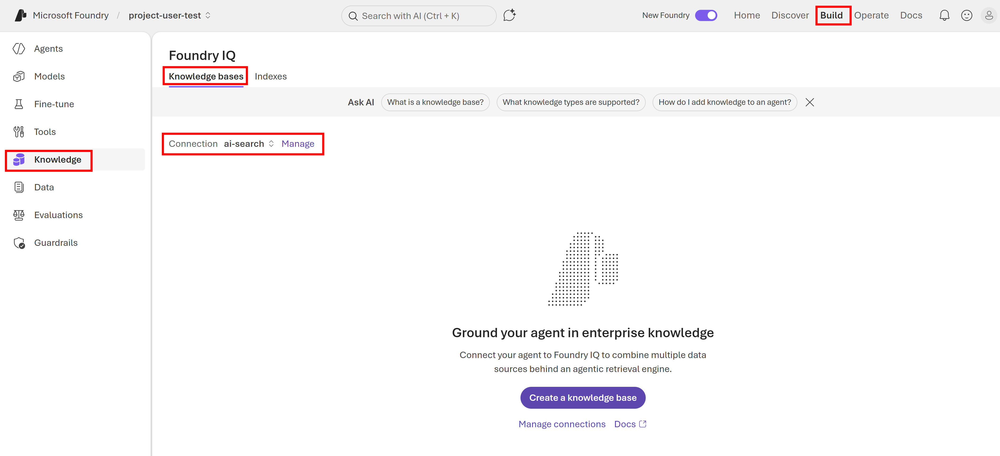{:class="img-fluid"}](images/2026-04-24-15-42-43.png)

Vytvořme knowledge base.

[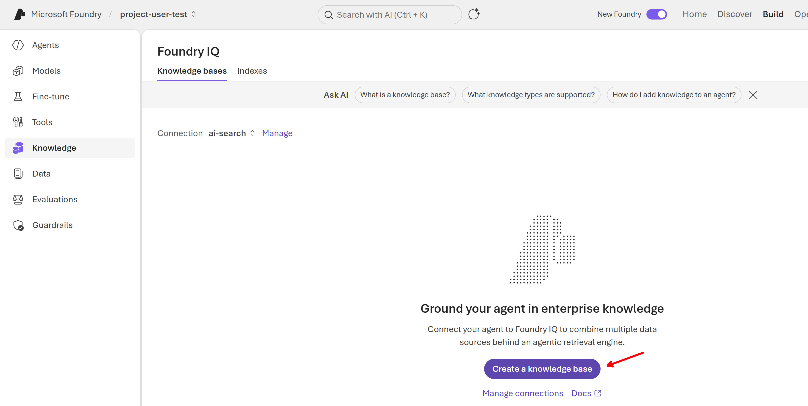{:class="img-fluid"}](images/2026-04-24-15-42-07.png)

[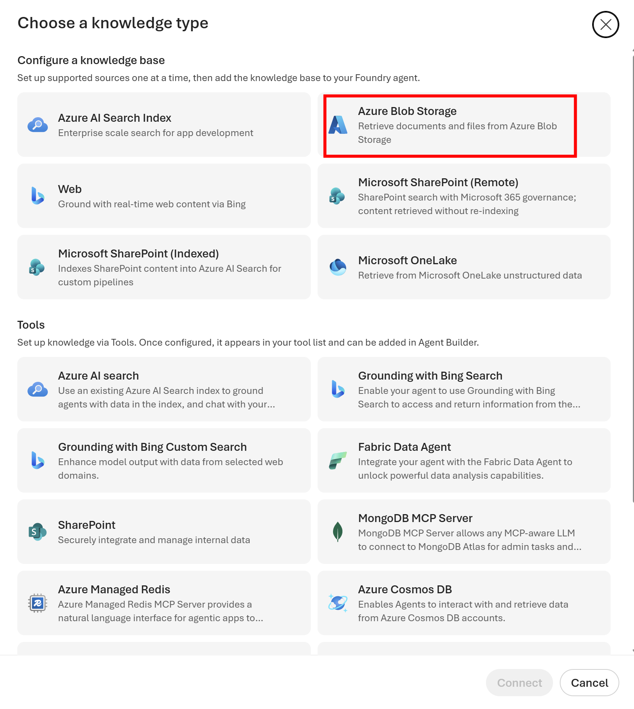{:class="img-fluid"}](images/2026-04-10-13-42-43.png)

Začneme s kontejnerem s PDF dokumenty jako první knowledge source. Použijte managed identity a model gpt-4.1.

[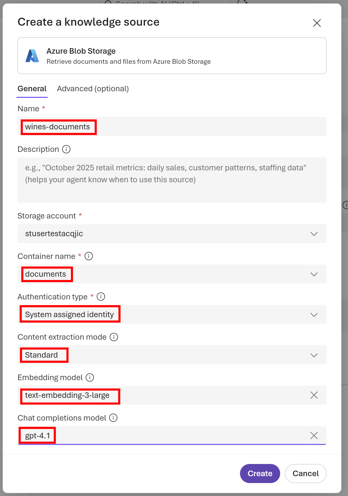{:class="img-fluid"}](images/2026-04-24-15-52-19.png)

### Nastavení Knowledge Base

Knowledge zdroj se nám vytváří, pojďme dokončit konfiguraci naší knowledge base. Dáme jí jméno, vybereme modely, dáme maximální effor na přemýšlení s agentic retrieval. Zajímavý je output mode. Buď můžeme zvolit vrácení samotných upravených dat nebo nechat rovnou syntetizovat hotovou odpověď. Pokud přímo tohle chceme nabídnout pro řadové tvůrce agentů dávalo by smysl Answer syntesis, ale protože my si nad tím vybudujeme vlastního Foundry Agenta, necháme si vracet Extractive data.

[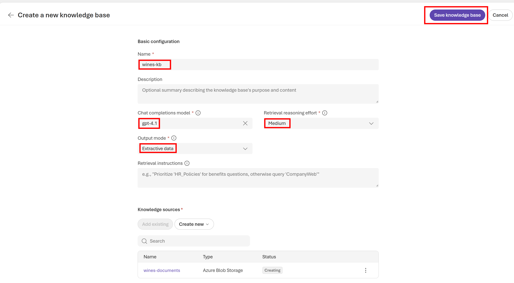{:class="img-fluid"}](images/2026-04-24-15-56-37.png)

### Přidání indexu
Do naší knowledge base ale určitě patří i index, který jsme vytvořili v AI Search z našeho `wines.json`. Přidáme.

[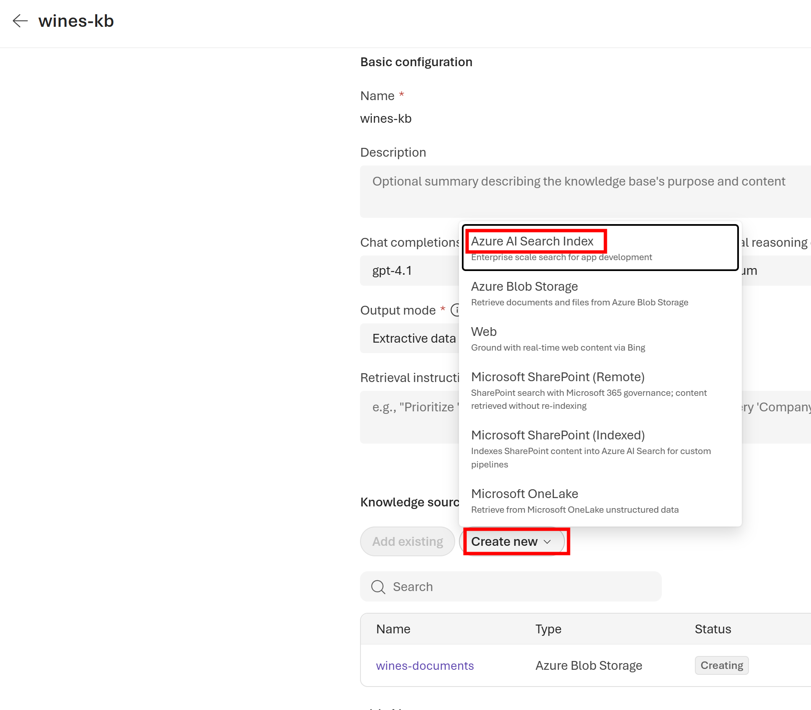{:class="img-fluid"}](images/2026-04-24-15-58-33.png)

[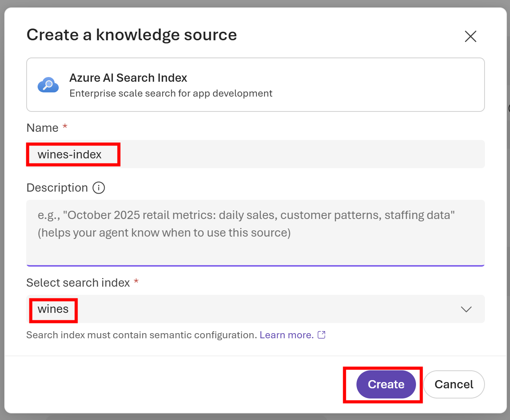{:class="img-fluid"}](images/2026-04-24-15-59-13.png)

Knowledgebase si uložte.

[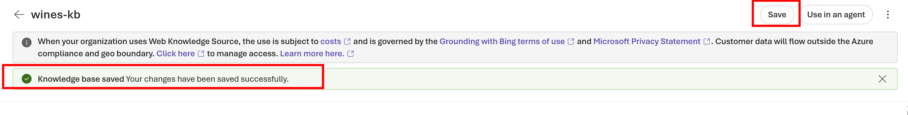{:class="img-fluid"}](images/2026-04-24-16-14-49.png)

### Přidání vybraného webového obsahu
Pro informace o víně máme vybrané prestižní časopisy a informační stránky a ty chceme aby byly pro vyhledávání dostupné, ale ne celý internet. Přidáme.

[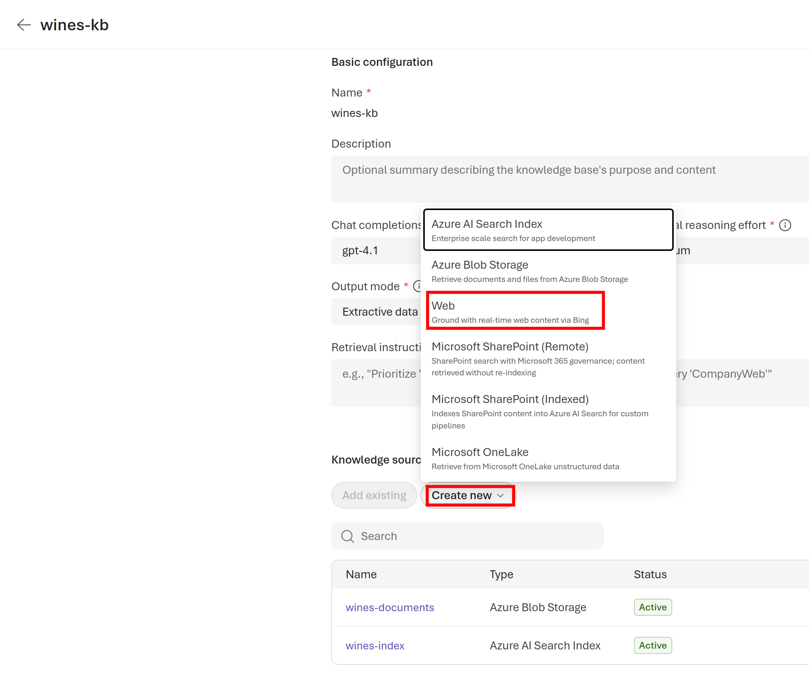{:class="img-fluid"}](images/2026-04-24-16-00-48.png)

Nasázejte tam tyto stránky:

- https://www.wsetglobal.com/
- https://courtofmastersommeliers.org/
- https://www.guildsomm.com/
- https://winefolly.com/
- https://www.jancisrobinson.com/
- https://vinepair.com/
- https://www.oxfordcompaniontowine.com/
- https://foodnetwork.co.uk/

[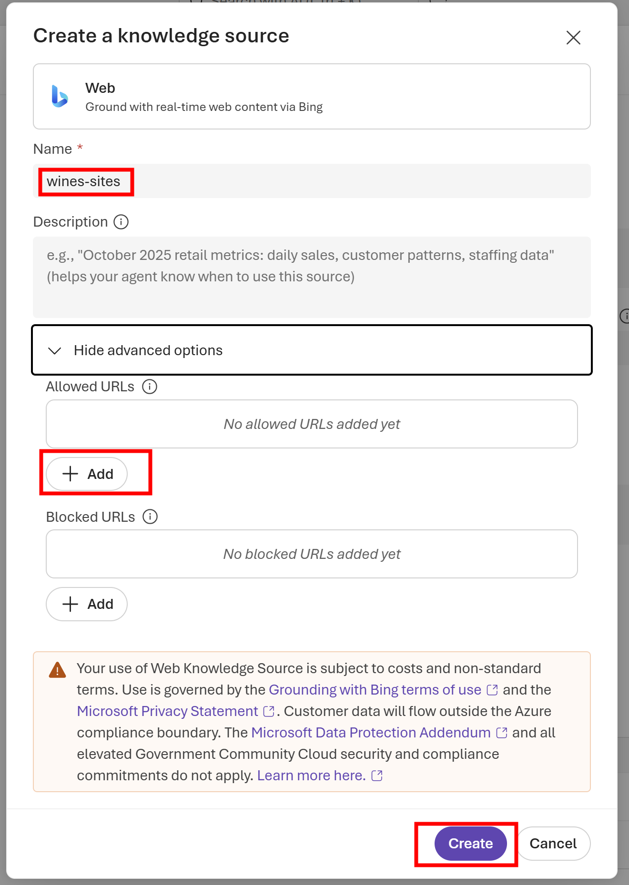{:class="img-fluid"}](images/2026-04-24-16-01-30.png)

[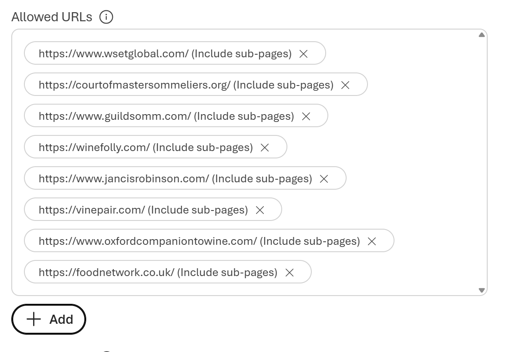{:class="img-fluid"}](images/2026-04-24-16-03-27.png)

Tím máme Knowedgebase která obsahuje tři bohaté zdroje znalostí.

[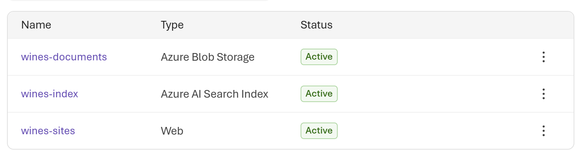{:class="img-fluid"}](images/2026-04-24-16-04-18.png)

Knowledgebase si uložte.

[{:class="img-fluid"}](images/2026-04-24-16-14-49.png)

### Jak zpracování PDF funguje?
Jste zvídaví a zajímá vás jak se PDF pod kapotou zpracovávají? Pokud ano, prohlédněte si skill pro indexaci vašich dokumentů.

[{:class="img-fluid"}](images/2026-04-24-16-06-26.png)

[{:class="img-fluid"}](images/2026-04-24-16-06-05.png)

Výsledkem je index z toho všeho - dokumenty, popisky grafů a obrázků, do textu převedené sloupce a tabulky apod.

[{:class="img-fluid"}](images/2026-04-24-16-07-17.png)

[{:class="img-fluid"}](images/2026-04-24-16-07-52.png)

### Úkol navíc
Ne všechno je zatím dostupné na kliknutí, ale řešení můžete snadno rozšířit o vlastní zpracování. Ve storage najdete také kontejner `audio` a v něm jsou nahrávky podcastů na téma o víně, například rozhovory s vašimi experty o vašem víně nebo trendy ve vinařství. Pokud máte čas, můžete požádat GitHub Copilot o vytvoření skriptu, který by využil nějakou službu v Microsoft Foundry pro převod těchto MP3 souborů na text, jejich umístění například do nějakého `transcripts` kontejneru a ten následně přidejte jako další knowledge source.

## Vytvoření znalostního agenta ve Foundry Agent Service
TBD

## Otestování agenta s evaluations
TBD