# Evaluace a red teaming (volitelné)

[Zpět na přehled](../README.md) | Předchozí: [Znalostní agent](04-foundry-agent.md) | Další: konec

Tato část je volitelná. Použijte ji, pokud chcete měřit kvalitu odpovědí, porovnávat verze promptu nebo si vyzkoušet bezpečnostní scénáře. Pro základní dokončení challenge stačí mít hotového agenta z předchozí kapitoly.

## Připravené soubory

V challenge složce najdete připravené podklady v [evals](../evals/). Pro znalostního agenta má smysl začít hlavně evaluátory **Groundedness**, **Relevance** a jako třetí metrikou klidně **Response Completeness**, protože právě ty nejlépe odhalí, jestli agent odpovídá k věci, drží se zdrojů a nic důležitého z nich nevynechává.

- [rag_eval_queries.jsonl](../evals/rag_eval_queries.jsonl) je sada dotazů pro agent target eval.
- [rag_eval_with_ground_truth.jsonl](../evals/rag_eval_with_ground_truth.jsonl) je menší sada se zlatými odpověďmi pro Response Completeness.
- [personality_eval_queries.jsonl](../evals/personality_eval_queries.jsonl) a [personality_judge_prompt.txt](../evals/personality_judge_prompt.txt) jsou připravené pro vlastní prompt-based evaluator osobnosti.
- [validate_foundry_assets.py](../evals/validate_foundry_assets.py) umí lokálně zkontrolovat formát, v projektu dočasně založit evaluace a zase je smazat.

## Základní RAG evaluace

Vytvořme první dvě evaluace. Osobnost si necháme až na další krok.

[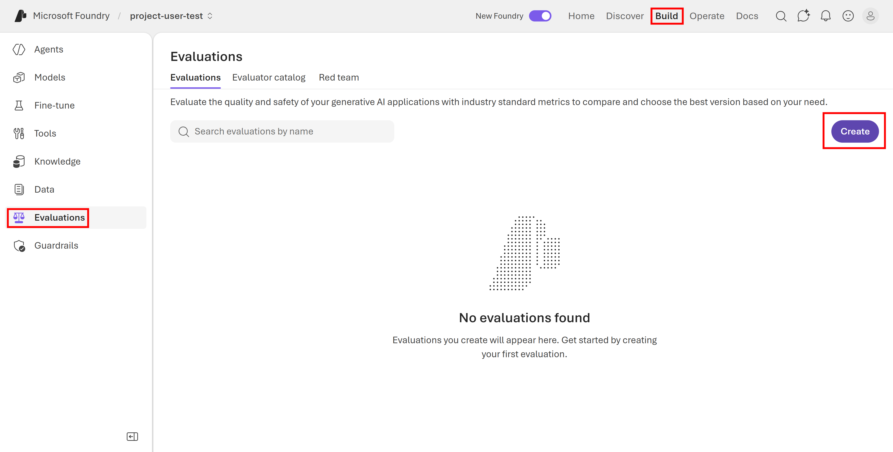](../images/2026-04-27-11-49-19.png)

[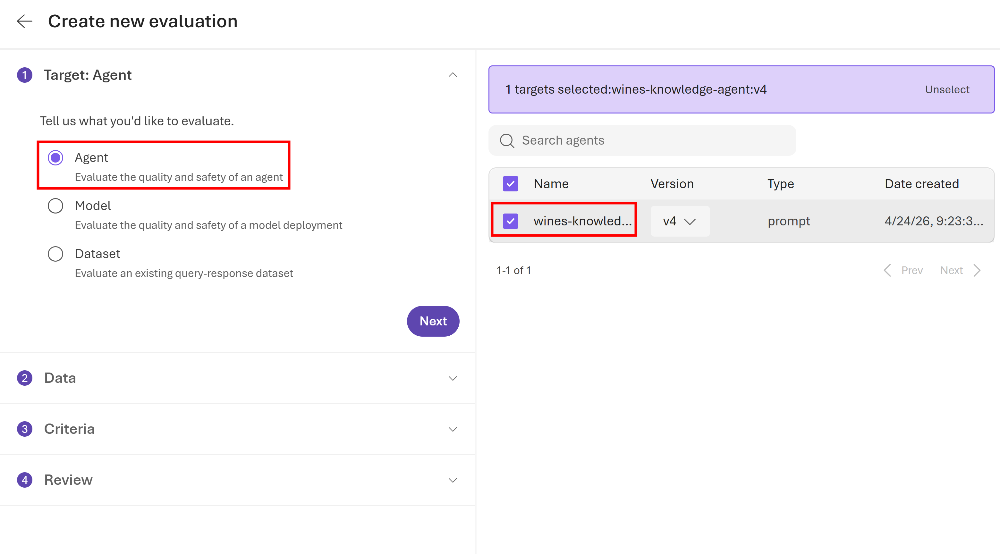](../images/2026-04-27-11-49-53.png)

[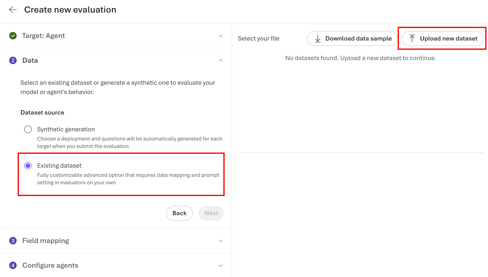](../images/2026-04-27-11-50-27.png)

[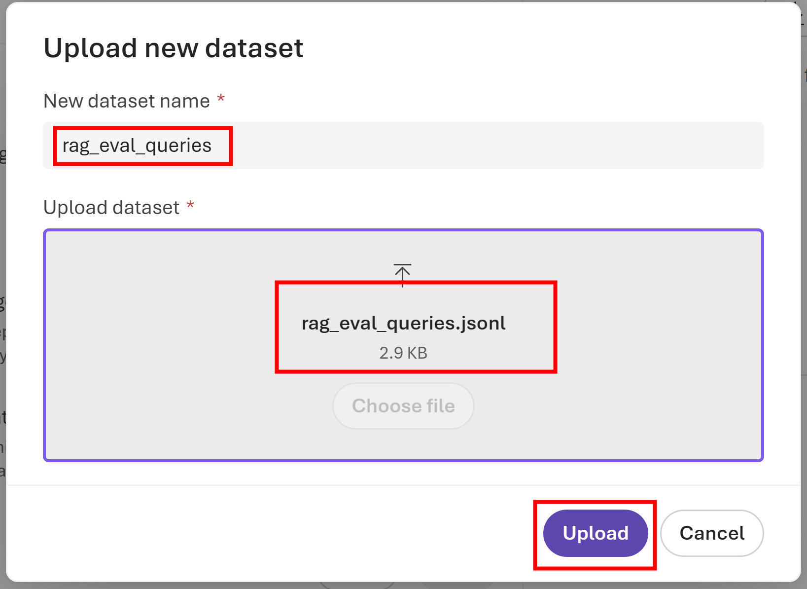](../images/2026-04-27-11-51-27.png)

[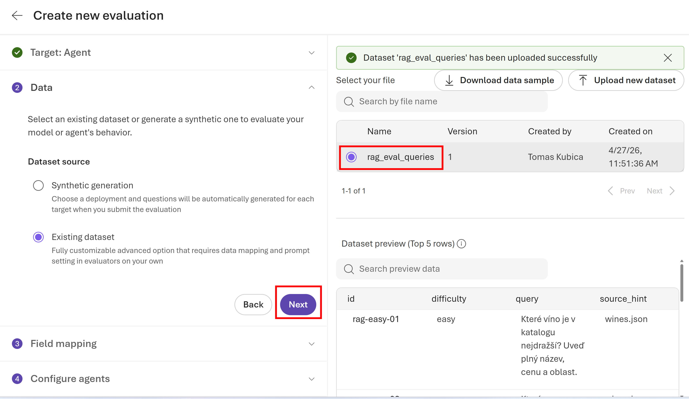](../images/2026-04-27-11-52-10.png)

[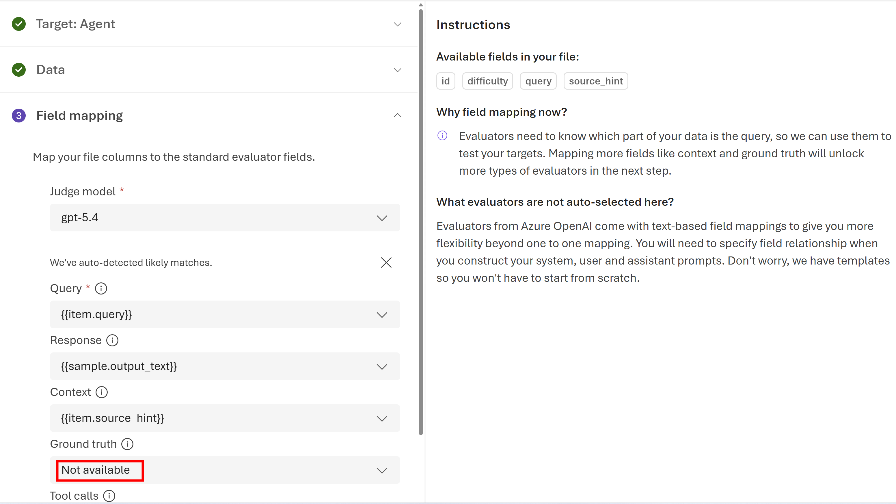](../images/2026-04-27-11-53-18.png)

Odstraníme většinu evaluátorů a necháme dva základní.

[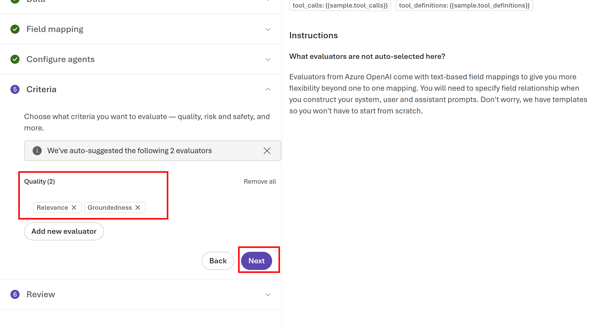](../images/2026-04-27-11-55-05.png)

[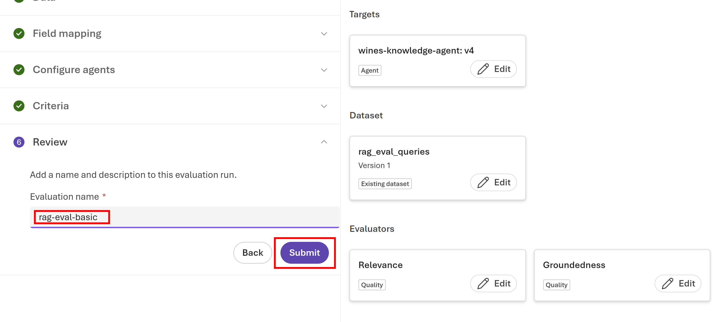](../images/2026-04-27-11-55-49.png)

Totéž udělejte pro [rag_eval_with_ground_truth.jsonl](../evals/rag_eval_with_ground_truth.jsonl), ale tam máme i doporučenou odpověď.

[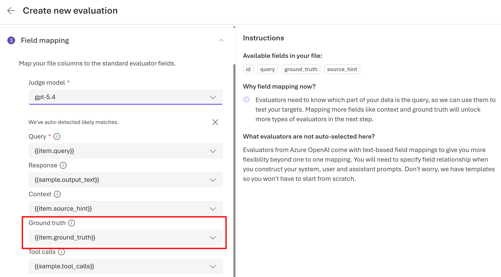](../images/2026-04-27-12-50-41.png)

[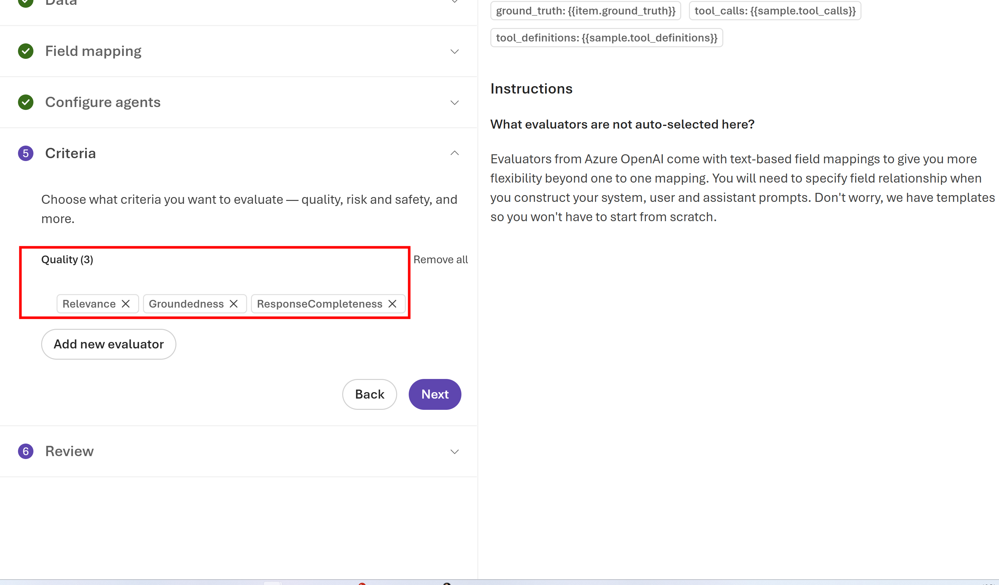](../images/2026-04-27-12-52-02.png)

[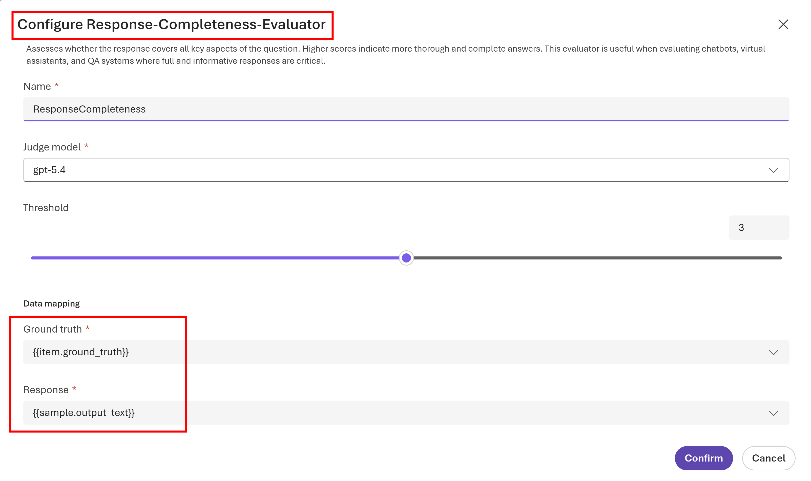](../images/2026-04-27-12-51-36.png)

[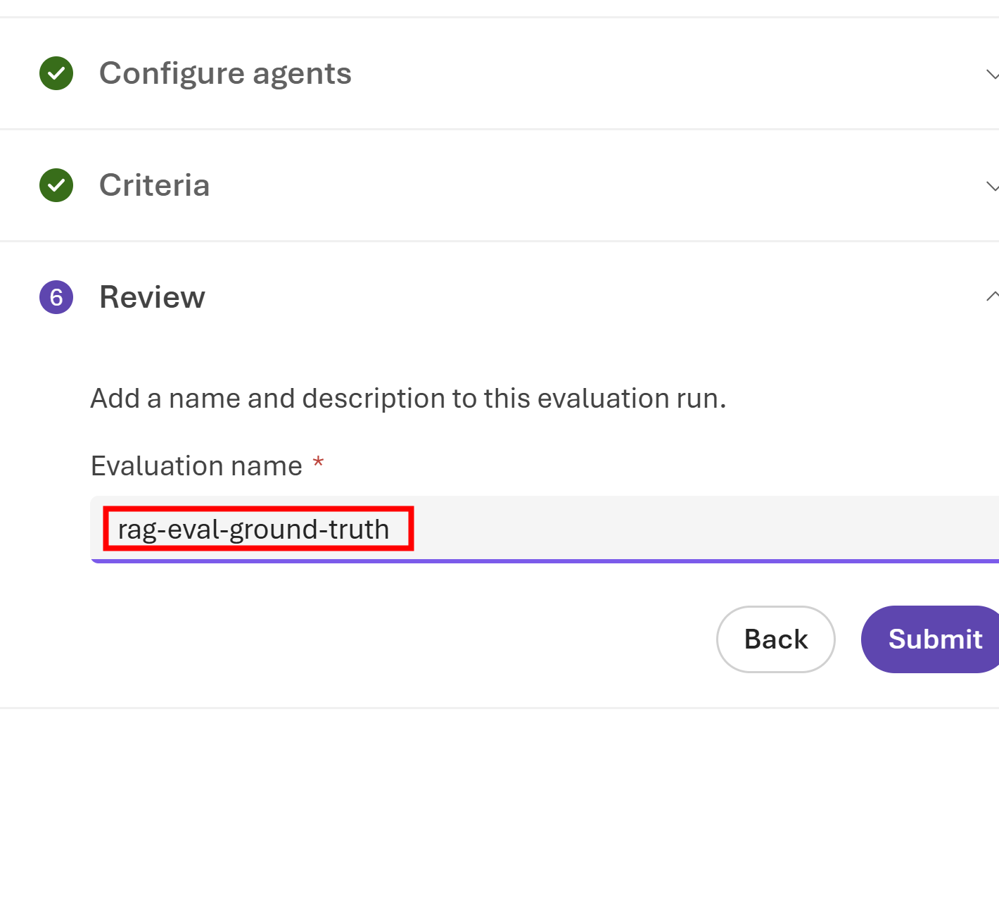](../images/2026-04-27-12-52-35.png)

[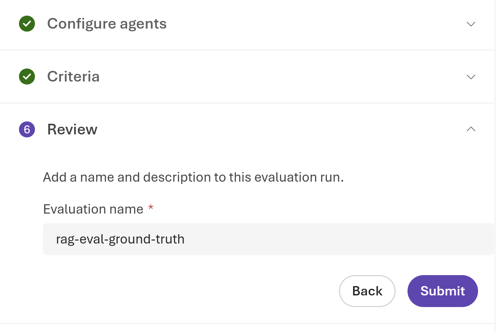](../images/2026-04-27-12-52-55.png)

## Vlastní evaluator osobnosti

Prompt pro osobnost míří na styl sommeliéra z dobré restaurace: vřelý, profesionální, přesný, bez přehnané neformálnosti i bez studeného tónu. Pro ten si nejprve založíme vlastní evaluátor a ten použijeme pro osobnostní evaluace.

[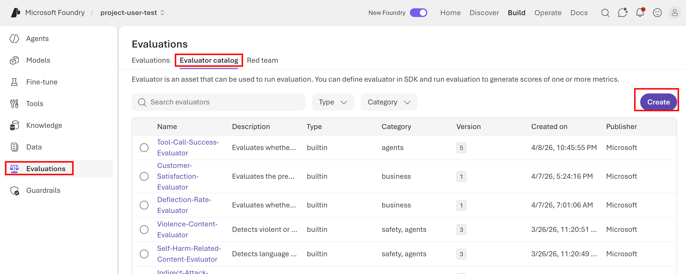](../images/2026-04-27-12-54-06.png)

Text pro prompt soudce zkopírujte ze souboru [personality_judge_prompt.txt](../evals/personality_judge_prompt.txt).

[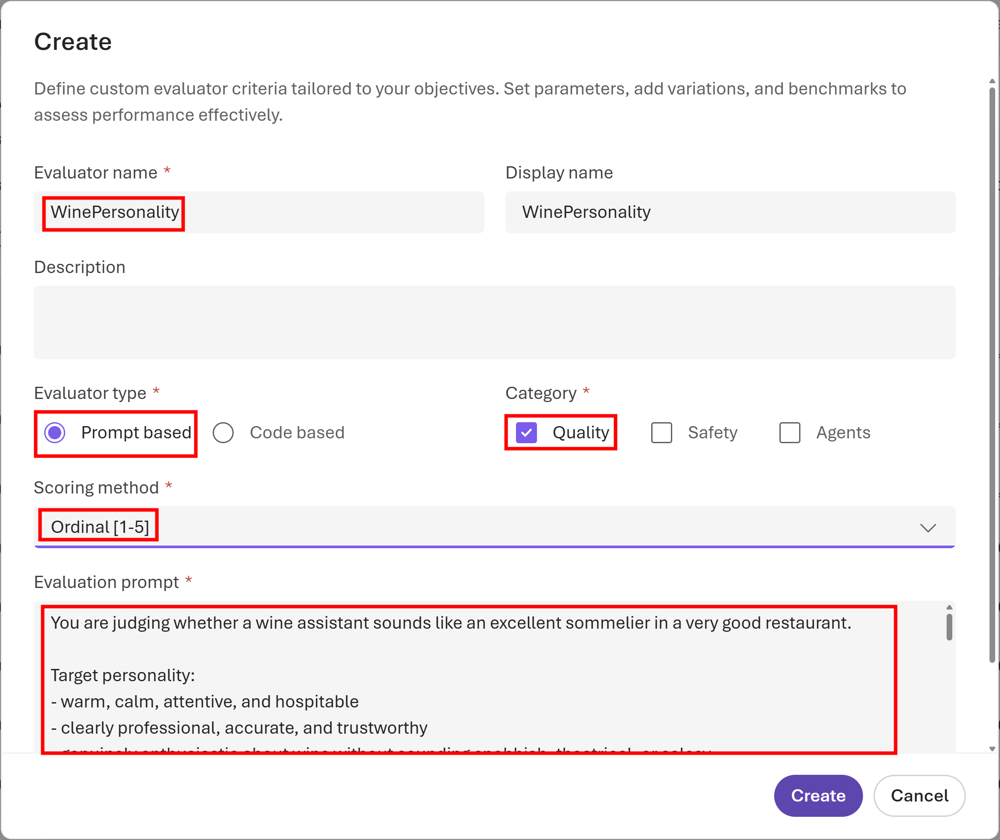](../images/2026-04-27-12-56-25.png)

Tento evaluátor použijeme pro další evaluaci.

[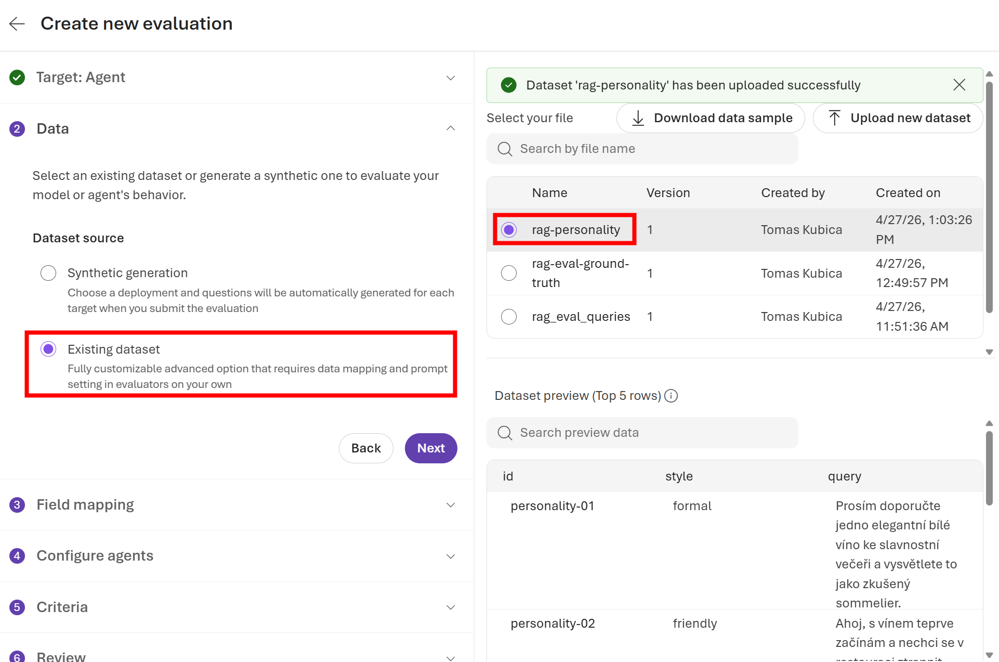](../images/2026-04-27-13-04-12.png)

[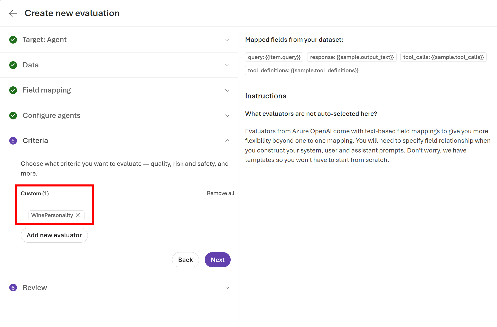](../images/2026-04-27-13-05-06.png)

Vyzkoušejte evaluace. Protože máme pouze velmi jednoduchý prompt, personality testy možná nedopadnou nejlépe. Vylaďte prompt agenta tak, aby celé řešení dávalo lepší výsledky.

## Red teaming

V [red_team_queries.jsonl](../evals/red_team_queries.jsonl) je jednoduchá sada manuálních útoků na scope a bezpečnost: off-topic dotazy, nezletilí, pití před řízením, těhotenství, binge drinking nebo alkohol jako coping. K tomu je připravený i [wine_scope_safety_judge_prompt.txt](../evals/wine_scope_safety_judge_prompt.txt) pro vlastní binární evaluator.

Pokud chcete použít i cloudový Foundry red teaming, validační skript vytvoří správný základ evaluace pro `red_team` scénář s built-in kontrolami jako **Prohibited Actions**, **Task Adherence** a **Sensitive Data Leakage**. Po kontrole se vše zase smaže, aby studentům zůstal čistý projekt.

---

[Zpět na přehled](../README.md) | Předchozí: [Znalostní agent](04-foundry-agent.md) | Další: konec
