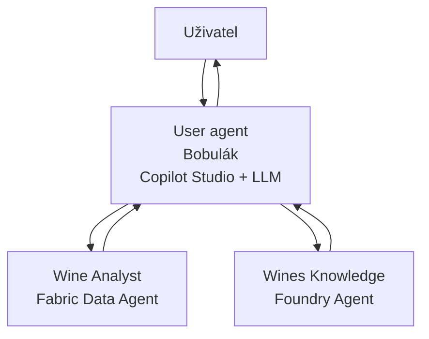

# User agent

V této části MicroHacku vytvoříte uživatelského orchestračního agenta v Copilot Studiu. Agent bude vystupovat jako jeden vstupní bod pro uživatele a bude směrovat dotazy na správné specializované agenty:

- **Wine Analyst** pro obchodní data z Microsoft Fabric,
- **Wines Knowledge** pro znalosti o víně z Microsoft Foundry.

Cílem je, aby se uživatel nemusel rozhodovat, kterého agenta má použít. User agent pozná záměr dotazu, zavolá správný zdroj a vrátí jednu konzistentní odpověď.

## Architektura

## Co postavíte

- Nového agenta v Copilot Studiu.
- Základní nastavení, model a generativní orchestraci.
- Instrukce pro směrování dotazů mezi dvěma specialisty.
- Připojení agenta Wine Analyst z Fabric.
- Připojení agenta Wines Knowledge z Foundry.
- Základní testy a volitelné evaluace.

## Průchod challenge

1. [Vytvoření User agenta](docs/01-create-user-agent.md)
2. [Instrukce a orchestrace](docs/02-agent-instructions.md)
3. [Připojení specialistických agentů](docs/03-connect-specialist-agents.md)
4. [Testování a evaluace](docs/04-test-and-evaluate.md)

## Doporučený postup

Nejdříve projděte povinné kroky až po funkčního User agenta se dvěma připojenými specialisty. Evaluace berte jako navazující bonus pro ladění kvality odpovědí a směrování dotazů.

Začněte kapitolou [Vytvoření User agenta](docs/01-create-user-agent.md).
